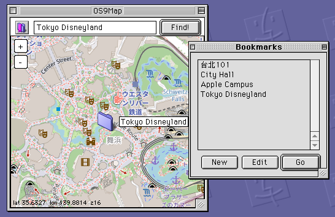

# OS9Map

**OS9Map** lets you browse [OpenStreetMap](https://www.openstreetmap.org/) on Mac OS 9. Search for landmarks and addresses, and save the places you care about as bookmarks for next time.

## Requirements

- Mac OS 9
- PowerPC processor
- 16 MB RAM (32 MB or more recommended)
- An internet connection (Open Transport TCP/IP)

## Features

- **Smooth scrolling map canvas** — drag with the mouse to pan; nearby tiles load as you go.
- **Place search** — built-in Nominatim lookup; type an address to jump straight there.
- **Bookmarks** — save the places you visit often and return to them from the menu in one click.

## Version History

| Version | Date | Changes |
| --- | --- | --- |
| 1.0.0 | 2026-06-21 | First public release: map scrolling, zooming, bookmarks |
