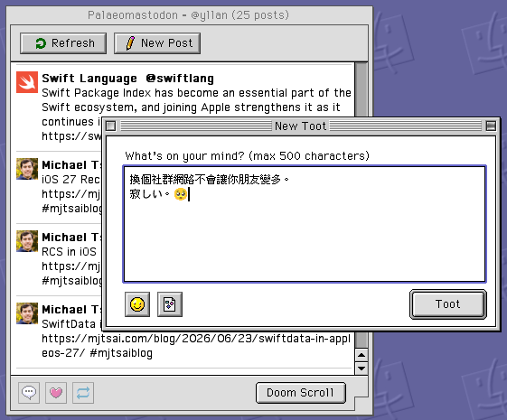

# Palaeomastodon

**Palaeomastodon** is a [Mastodon](https://joinmastodon.org/) app for Mac OS 9. Come join the Decentralized Social Network Fediverse Blah Blah Blah!
<strike>(Warning: it's not DeFi, it won't make you a fortune.)</strike>

Palaeomastodon (the ancient mastodon) is an ancestor of the Mastodon — and down in the fossil-laden strata of Mac OS 9, well, you get the idea.

## Requirements

- Mac OS 9
- PowerPC processor
- 32 MB RAM (64 MB or more recommended)
- An internet connection (Open Transport TCP/IP)

## Features

- Browse your timeline
- View image attachments
- Reply, repost, like, and quote
- Post with image attachments and emoji

## Version History

| Version | Date | Changes |
| --- | --- | --- |
| 1.1.0 | 2026-06-24 | First public release: timeline, posting, emoji |

## Donate

- [Buy Me a Coffee](https://buymeacoffee.com/yllan)
