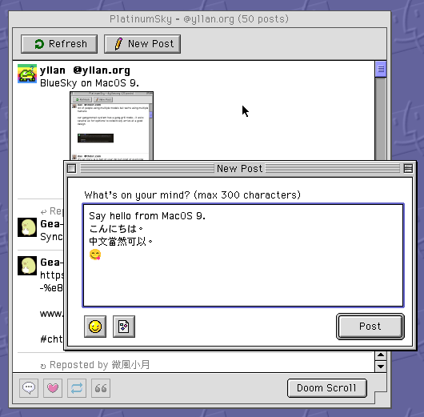

# PlatinumSky

**PlatinumSky** lets you [BlueSky](https://bsky.app/) on Mac OS 9 — savour the social anxiety and let the dopamine flow.

## Requirements

- Mac OS 9
- PowerPC processor
- 32 MB RAM (64 MB or more recommended)
- An internet connection (Open Transport TCP/IP)

## Features

- Browse your timeline
- View image attachments
- Reply, repost, like, and quote
- Post with image attachments and emoji

## Version History

| Version | Date | Changes |
| --- | --- | --- |
| 1.1.0 | 2026-06-25 | First public release: timeline, posting, emoji |

## Donate

- [Buy Me a Coffee](https://buymeacoffee.com/yllan)
