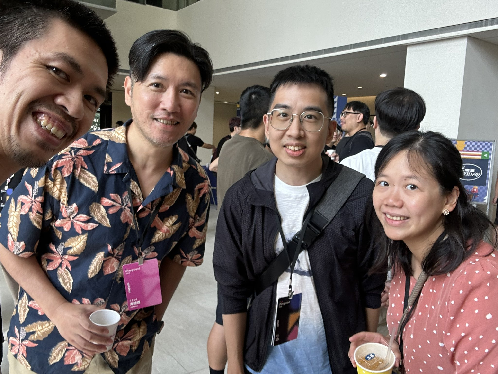
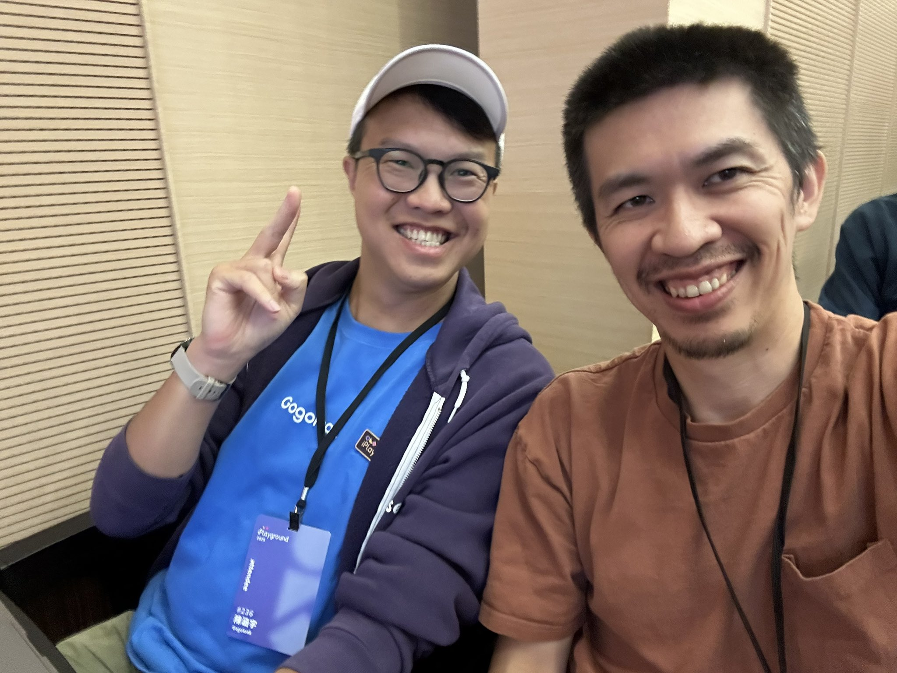

# iPlayground 2025

今年投了主題，沒上。本來想說小孩才剛滿週歲，還是不要勉強參加好了。結果有朋友說有票可以給我，我想了想，去見見大家感受氣氛也不錯，就請了到府保母顧小孩，自己一個人去參加大拜拜了。

議程都聽不太懂，因為我已經一陣子沒有做 Mac / iOS 上的程式開發工作了。然而見到許多朋友還是很開心。

礙於時間不能參與晚上的活動有點可惜。但也許對我來說，主要的意義在於抽離育兒，讓自己放個假，能自由的走走。心情很好，感覺還是有和世界連上線。