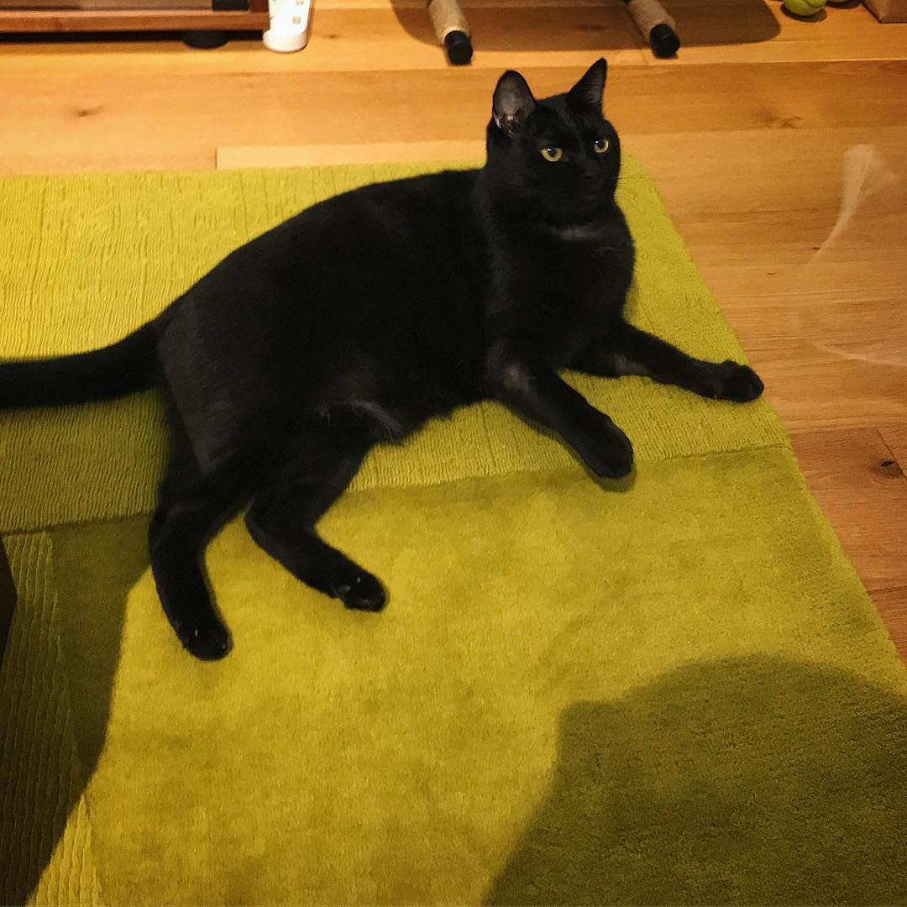

# 天天

天天是一隻14歲的黑貓。原本的飼主甚至是現在有點知名度的人，後來在2017年輾轉來到我們家，已經快十年了。在我們家的時間已經超過原生家庭（？）兩倍了。

天天是一隻很親人的貓，但是他討厭，應該說害怕小孩。前飼主因為生了小孩，可能是小孩會欺負貓，天天每次看到小孩就逃走。

這幾年我也生了小孩，還生了兩個。親人看我每天忙著顧小孩焦頭爛額，問說要不要幫我養天天。我考慮了一下，其實捨不得。還是咬牙繼續養。

貓是一種其實很省事的動物，他自己會在沙盆裡上廁所，也不用帶去公園遛。在忙小孩的這段期間我就是滿足最基本的生理需求吃喝拉撒睡而已。換飼料換水挖貓沙，很偶爾想到才會幫他梳梳毛、玩一下。

阿夏出生那陣子，天天的脾氣稍微有點改變了，他有時甚至會親近阿夏，容忍阿夏在他身上亂揉亂抓。

不過我們也都覺得他身體出了一點問題。肚子和後腿的毛都被他舔光，嘔吐也越來越嚴重。然而以前都看過醫生，也沒什麼改善，就想說當作老症頭，有空再說吧。

今年三月的時候，有天晚上天天窩在我的小腿上睡覺。不知道為什麼我有種心很不安、慌張的感覺。隔天醒來趕快抱來量體重，結果他體重竟然掉了 1/3。平常只覺得有變瘦而已，想不到那麼嚴重。趕快帶去獸醫看。結果是嚴重的慢性腎病。之後也做了各種 X光、超音波等檢查，還發現他腸壁肌肉層異常增厚，醫生說是他看過最嚴重的案例。當時很氣自己為什麼那麼晚才帶他去看醫生。

總之就是兩個禮拜回診一次，伴隨常駐在家的皮下輸液、類固醇等各種藥物，偶爾還要打個造血針，進入長照時代。

最近常常失手，輸液刺穿皮膚流出來要讓天天多挨一針。可能是前幾次打太深，天天哀號，所以我潛意識就不太敢打太深，結果太淺又戳穿皮膚。

幸好經過這三個月的積極治療，最近一次回診，體重回復讓人不可思議，腎指數也有好轉。雖然醫師說應該是沒辦法不要輸液，但是隨著狀況穩定可以降低頻率。希望天天能繼續維持健康狀況，陪著阿星上小學啊。